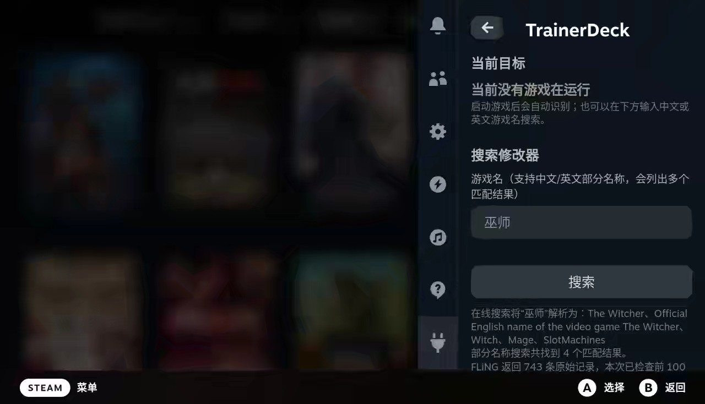

# TrainerDeck

**简体中文** | [English](README_EN.md)

TrainerDeck 是一个面向 Steam Deck 游戏模式的 Decky Loader 插件。它可以识别当前游戏、搜索和下载独立 FLiNG 修改器、管理 Steam 启动项，并把受支持修改器的控制菜单同步到 Decky 快捷面板。

### 截图:

 
 


## 主要功能

- 自动识别当前运行的 Steam 游戏或非 Steam 游戏并且搜索 FLiNG 修改器。
- 手动使用中文或英文搜索 FLiNG 修改器。
- 下载修改器绑定到对应的 Steam 库条目，添加 CheatDeck 启动参数。
- 对风灵月影新版本（19 年+）修改器提供 Decky 控制面板，支持开关、数值输入和一次性动作。
- 提供启动项一键恢复；恢复启动项不会删除已下载的修改器。

## 工作方式

```text
Decky React 面板
        ⇅ Decky RPC / events
Python 插件后端
        ⇅ 127.0.0.1 + 随机会话令牌
TrainerDeck Bridge
        ⇅ 同进程菜单协议与核心回执
受支持的 FLiNG 修改器
```

Bridge 会在运行时准备修改器的缓存副本，不覆盖下载的原始 EXE。只有 Bridge 明确确认兼容的菜单项目才会在 Decky 中开放控制；未知控件或不支持的修改器仍可保留普通下载和绑定能力。

## 使用前须知

- 仅建议用于单机或离线游戏。不要在多人游戏、反作弊环境或可能影响其他玩家的场景中使用。
- TrainerDeck 不包含或再分发游戏修改器。修改器由用户操作后从第三方站点下载，使用风险由用户自行判断。
- FLiNG 没有为本项目提供稳定 API，网站结构或修改器实现发生变化时，搜索、下载或直接同步可能暂时失效。
- 直接同步主要面向受支持的托管 WPF/WinForms 修改器。纯原生 UI、未知协议以及部分旧修改器不会显示可操作面板。
- 首次完成绑定后，需要退出并重新启动游戏，修改器才会跟随新的 Steam 启动项运行。
- 当前支持 ZIP 和直接 EXE；RAR 不受支持。

## 安装

### 使用发布包

1. 安装 Decky Loader 3.0 或更高版本。
2. 从 [Releases](https://github.com/chen-coco/trainerdeck/releases) 下载 `TrainerDeck-<version>.zip`。
3. 把 ZIP 传到 Steam Deck，例如 `~/Downloads/`。
4. 打开 Decky 设置的“开发者”页面，选择“从 ZIP 安装插件”。
5. 选择 ZIP 后重新加载插件或重启 Decky Loader。

不要使用 GitHub 自动生成的“Source code”压缩包代替插件安装包。


## 基本使用

1. 启动目标游戏，再打开 `…` → Decky → TrainerDeck。
2. 确认插件识别出的当前游戏名称，按“搜索”；也可以手动输入中文片段或英文游戏名。
3. 选择匹配结果并下载、绑定。没有当前游戏目标时只会下载，不会修改 Steam 启动项。
4. 首次绑定后退出并重新启动游戏。
5. 再次打开 TrainerDeck；兼容的修改器会显示“修改器面板”。
6. 完成操作后按 SteamOS 的正常方式关闭快捷菜单。原修改器窗口仍可通过 Steam 窗口切换打开。

同一份已安装修改器一次只能绑定一个游戏条目；如需改绑，请先对原游戏执行解除绑定，
避免两个 AppID 共用并覆盖同一份启动 manifest。

设置页面可以修改下载目录，以及选择是否启用：

- 自动搜索并添加当前游戏；
- 关闭整个快捷菜单后恢复游戏输入。

这些自动功能默认关闭。检测到已有 CheatDeck 或其他受管启动配置时，自动绑定会跳过，避免静默改写现有设置。

## 网络与隐私

- 搜索和下载会访问 FLiNG 的公开页面或索引。
- 手动中文搜索可能把查询文字发送到 MyMemory 翻译服务，并使用 Wikimedia 和 Steam 信息验证英文名称。
- “自动搜索并添加当前游戏”默认关闭；关闭时，插件不会因为识别到当前游戏而自动联网搜索或下载。
- Bridge 通信只监听 `127.0.0.1`，并使用每次会话生成的随机令牌。

## 故障恢复

如果绑定后游戏无法启动，不必先启动目标游戏：打开 TrainerDeck 首页并选择“一键恢复启动项”。插件会恢复绑定前保存的 Steam 游戏或非 Steam 快捷方式启动参数，不删除修改器文件。

其他常见检查：

- 插件未出现：确认没有形成 `TrainerDeck/TrainerDeck/plugin.json`。
- 后端加载失败：运行 `sudo journalctl -u plugin_loader.service -b --no-pager | grep -i TrainerDeck`。
- 面板提示 Bridge 版本过旧：升级或修复直接同步组件，然后重启游戏。
- 某个项目不可操作：这通常表示 Bridge 没有确认控件类型、调用方式或当前状态，插件不会回退为模拟按键。

## 从源码构建

### 环境要求

- Node.js 16.14 或更高版本
- pnpm 9
- Python 3.10 或更高版本
- .NET SDK

### Windows PowerShell

```powershell
pnpm install --frozen-lockfile
pnpm run check
pnpm run build
./bridge/build.ps1 -Configuration Release
pnpm test
pnpm run package
```

### Linux 或 macOS

```bash
pnpm install --frozen-lockfile
pnpm run check
pnpm run build
./bridge/build.sh Release
pnpm test
pnpm run package
```

`pnpm run package` 只负责收集和校验已有构建产物，不会自动重新编译前端或 Bridge。生成的安装包位于：

```text
release/TrainerDeck-<version>.zip
```

当前版本对应 `release/TrainerDeck-0.7.0.zip`。

`TrainerDeckBridgeLauncher.exe` 内嵌 CLR2 与 CLR4 两份 Bridge payload。运行时会按
修改器托管 UI 的元数据代际选择完全匹配的一份，并只在专用缓存目录写出规范名
`TrainerDeckBridge.dll`。安装包不单独发布任何 `TrainerDeckBridge*.dll` payload。

安装包的主要结构如下：

```text
TrainerDeck/
├── dist/index.js
├── main.py
├── py_modules/
│   ├── trainerdeck_core.py
│   └── trainerdeck_runtime.py
├── bin/bridge/
│   ├── TrainerDeckBridgeLauncher.exe
│   └── Mono.Cecil.dll
├── package.json
├── plugin.json
├── README.md
├── README_EN.md
└── LICENSE
```

## 项目结构

| 路径 | 用途 |
| --- | --- |
| `src/` | Decky React/TypeScript 前端 |
| `main.py` | Decky Python 入口 |
| `trainerdeck_core.py` | 搜索、下载、安装和绑定逻辑 |
| `trainerdeck_runtime.py` | 修改器运行时与 Bridge 会话管理 |
| `bridge/` | .NET Bridge、Launcher 和构建脚本 |
| `scripts/package.py` | 安装包生成及内容校验 |
| `tests/` | Python、Node.js 和 Bridge 回归测试 |
| `docs/` | 架构、安全边界和同步协议说明 |

## 参与开发

欢迎提交 Issue 或 Pull Request。请不要把下载的修改器、游戏文件、分析样本、访问令牌或包含个人路径的日志提交到仓库；问题日志应先删除用户名、目录和其他敏感信息。

## 许可证

项目代码使用 [GPL-3.0-or-later](LICENSE) 许可证。`Mono.Cecil` 等第三方组件的归属和许可说明见 [bridge/THIRD_PARTY_NOTICES.txt](bridge/THIRD_PARTY_NOTICES.txt)。
