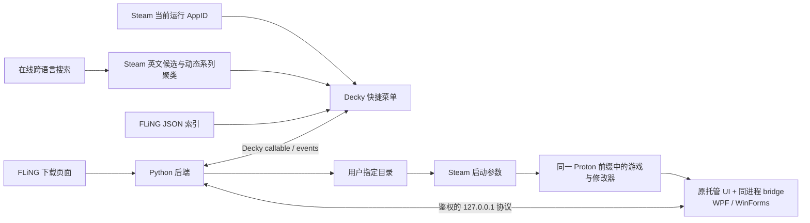

# TrainerDeck 架构与边界

## 数据流



插件不修改 CheatDeck 的私有状态。由于 Proton 只接受一个
`PROTON_REMOTE_DEBUG_CMD`，TrainerDeck 会把自己下载的修改器与现有 CheatDeck
标准单程序配置进行路径核对。仅当修改器路径相同、共享目录匹配、两个变量各出现一次且
启动项没有动态展开或 shell 运算符时，才把该配置安全交接给 launcher：

```text
PROTON_REMOTE_DEBUG_CMD="'/absolute/path/to/TrainerDeckBridgeLauncher.exe'"
PRESSURE_VESSEL_FILESYSTEMS_RW="/absolute/path/to/trainer-folder"
```

绑定记录会原样保存交接前的完整启动项；解除绑定或一键恢复时重新启用原 CheatDeck
配置。无法证明等价的路径、多程序命令、重复变量和复杂 shell 命令都会停止绑定，不会
静默覆盖。launcher 在同一个 Proton/Wine 环境生成并启动 bridge 临时副本，原修改器
EXE 保持不变；其原生窗口与 TrainerDeck 菜单可同时使用。若同步组件不受支持，仍可把
原 EXE 交给 CheatDeck 管理。

v0.5.1 的 launcher 把“本次启动的新鲜 Bridge 就绪信号”作为保留补丁进程的必要
判据。v0.5.0 在 Sifu 实机上记录到补丁进程约 10.29 秒后以退出码 0 结束，且
`bridge_ready=false`；旧策略因其超过 5 秒短退出阈值而禁止 fail-open，最终既没有
同步菜单，也没有启动原 EXE。修正后会等待完整观察窗：窗口结束时若补丁进程已经退出且
仍无新鲜就绪信号，就始终启动原 EXE；进程仍存活或已产生新鲜就绪信号时才抑制回退，
避免真正的重复实例。

v0.6.1 曾把 Bridge 后端收敛为唯一的 `net35` DLL。v0.7.0 保持单一外部 Host 的部署
边界，同时恢复严格的双代际兼容：`net462` 的 `TrainerDeckBridgeLauncher.exe` 内嵌
`net35`/CLR2 与 `net40`/CLR4 两份同名 Bridge payload，先同时核对目标 UI 的
`RuntimeVersion` 与唯一 `mscorlib` 主版本，再选择完全匹配的一份。两种 payload 都不作为
外部插件文件发布；Launcher 只把选中版本以规范名 `TrainerDeckBridge.dll` 写入该修改器的
专用缓存，未知或混合代际失败关闭。缓存按修改器哈希、AppID 与会话 token 哈希隔离为
不可变代际，补丁 EXE、所选 Bridge 和本次实际读取的 manifest 均经唯一临时文件原子发布，
因此并发启动或后端轮换 token 不会拼出跨会话的混合缓存。正常启动时 Host 通过子进程环境
传入外层原子 manifest 的绝对路径；运行中的 Bridge 重连会重新读取它，后端重启轮换端口与
token 时无需改写不可变缓存，也无需重启修改器。
v0.6.2 将修改器操作与返回游戏拆开：操作成功只接收权威快照并留在面板，显式返回动作
才关闭 Quick Access 并恢复当前游戏焦点。
v0.6.4 撤回自动 locale 启动参数，并删除全局返回按钮与 App 级窗口提升。操作成功后仍只
更新权威快照并保留 Quick Access，由用户通过 SteamOS 正常关闭菜单。Bridge 0.6.2
允许英文菜单省略 widget DSL，以中文行的控件元数据为权威，同时保留两种语言的标签和提示。
v0.6.5 以可选设置恢复输入上下文，不再使用 AppID 级提升：`useQuickAccessVisible` 只监听
整个 Quick Access 的 `true → false`，并且仅在本轮有成功修改时，把 QAM 打开时保存的具体
游戏 Window ID 交给 Steam `WindowStore.SetFocusedAppWindowID`。同 AppID 只有两个窗口时
执行“另一窗口 → 游戏窗口”；超过两个窗口时只接受标题可唯一识别为 FLiNG/Trainer 的窗口，
避免误选启动器或崩溃对话框。设置/恢复路由会先取消本轮恢复。
v0.6.6 将启动时联网行为改为默认关闭的 `auto_search_and_add`。关闭时只读取本地 Steam
显示名并填充输入框；设置未加载、后端不可用或绑定读取失败都保持关闭。开启后先完整读取
启动项和绑定；任一受管变量都会在联网前终止自动流程。只有唯一的 FLiNG `exact-app`
结果回映当前 Steam AppID 时才自动下载，并在下载后、绑定前再次检查目标身份、绑定和启动项。
绑定读取使用超时与退避重试；代际令牌、跨面板实例的全局单飞锁和短期 handled key
阻止游戏切换、关闭设置、面板重挂载或重复渲染造成重复下载/误绑。非 Steam 快捷方式
缺少可等价核验的商店 AppID，自动搜索后仍保留人工确认。
v0.6.7 把 Bridge 传输存活与修改器 UI 调度拆开：独立后台线程每 3 秒发送一次 heartbeat，
状态轮询即使阻塞在 UI 读取也不会让后端误判 TCP 断开；网络读线程只使用 WPF/WinForms
`BeginInvoke` 投递命令，完成结果再交给线程池发送。全局 single-flight 防止 UI 卡住时
继续堆积修改请求，所有普通帧按连接 generation 写入，旧连接迟到的结果不能污染新连接。
前端在真实断线时继续只读呈现最后一次菜单，并明确显示自动重连状态。
v0.6.8 删除前端 `WindowStore.SetFocusedAppWindowID` 的窗口 ID 来回切换。模块级协调器和
Decky 全局组件共同保存本轮成功操作，即使插件面板卸载或切换标签也能观察 QAM 关闭。
协调器捕获唯一的主 GamepadUI router，打开带 token 的极简整屏路由；该路由完成两帧绘制、
最短驻留并取得 Steam 导航/原生焦点信号后，用同一 router 弹出自己压入的历史项，再调用
`SteamClient.Apps.RaiseWindowForGame` 返回仍在运行的目标 AppID。游戏切换、QAM 重开、
设置导航和插件卸载都会取消 token，不能回退用户后来进入的其他页面。

## 数据源

前端通过 Decky `fetchNoCors` 搜索 `flingtrainer.com` 的公开 WordPress JSON 索引，
不依赖插件 Python socket。Python 后端只在下载时读取修改器详情页，并选取第一个
（通常是最新）独立下载项。站点没有为本项目承诺稳定 API，因此两部分都视为
可替换适配器。

手动中文部分搜索不维护逐游戏别名表。前端同时以中文裸词和游戏语境调用 MyMemory，
并合并 Wikimedia 游戏页面、Steam 候选以及非 Steam 快捷方式的可执行文件名；得到的
英文候选继续查询 Steam 商店。插件从多个 Steam 英文标题的重复连续词组动态生成系列查询，
并优先复用 `SteamClient.Apps.GetCachedAppDetails` 中已经存在的 franchise 关联，
再交给 FLiNG 搜索并按官方页面 URL 去重。手动搜索会合并主候选、备用跨语言名称和
所有匹配页面；启用自动添加后，当前 AppID 不走系列扩展，只接受精确游戏名并展示最佳一项。
自动结果只有唯一精确回映到当前 AppID 才会下载和绑定；手动结果由用户明确选中后可绑定到界面
显示的当前目标，用于 Epic、GOG 等非 Steam 快捷方式。

## 游戏识别

前端启动时读取 `@decky/ui` 的 `Router.MainRunningApp`，随后监听
`SteamClient.GameSessions.RegisterForAppLifetimeNotifications`。取得 AppID 后，
通过 `SteamClient.Apps.RegisterForAppDetails` 读取显示名和当前启动参数。普通 Steam
游戏读取 `strLaunchOptions` 并使用 `SetAppLaunchOptions`。非 Steam 快捷方式也优先
使用这个共用通道（与 CheatDeck 当前实现一致）；只有客户端确实没有返回
`strLaunchOptions`、但返回了 `strShortcutLaunchOptions` 时，才回退
`SetShortcutLaunchOptions`。绑定记录会保存实际使用的字段，冲突检查、写后回读和
一键恢复据此选择同一通道。非 Steam 快捷方式的本地 AppID 仅作为内部寻址键，同时
记录目标类型和快捷方式 EXE，用户无需查看或选择。没有字段元数据的旧绑定在恢复时会
分别检查普通字段与快捷方式字段，只在可确认属于 TrainerDeck 时写回；两边都命中则
停止，避免猜测覆盖。

默认模式只自动填入本地游戏名；显式开启自动添加后，搜索、下载和绑定构成一次受保护流程。
首次下载和写入启动参数后，修改器要到下一次启动游戏时才会随 Proton 启动。
插件后端重启时会把当前安装包中的 launcher 与运行依赖更新到每个有效旧绑定的原目录；
Launcher 路径保持不变，因此 v0.4.9 绑定无需改写启动项即可使用新二进制。Host、Cecil
与 manifest 在同一串行事务中先写入唯一 staging，再原子替换 live 路径；任一步失败会
回滚已发布项，确认整组成功后才清理旧外置 Bridge。若覆盖、哈希读取或 manifest 写入
失败，对应 AppID 会进入 `error` 快照，前端面板显示具体原因，而不是继续显示笼统的
`not_prepared`。一个物理修改器安装同一时间只允许归属一个活跃 AppID，解除原绑定后才可
重新绑定，避免两个启动项争用同一份外层 manifest。

## Decky API 边界

- 插件注册、后端 RPC、通知与目录选择分别直接使用 `@decky/api` 的
  `definePlugin`、`callable`、`toaster` 和 `openFilePicker`。
- 当前游戏、应用详情和启动参数直接使用 `@decky/ui` 暴露的 `Router` 与全局
  `SteamClient`。
- 设置和运行时文件写入 Decky 提供的 `DECKY_PLUGIN_SETTINGS_DIR` 与
  `DECKY_PLUGIN_RUNTIME_DIR`；Decky 没有通用的插件设置存储器。
- Windows bridge 到 Python 后端只增加一个随机端口的 `127.0.0.1` 连接；Decky
  前后端仍复用 `callable` 与 `decky.emit`，没有重复实现插件 RPC。
- 搜索复用 Decky `fetchNoCors`；受限下载、校验和安全解压保留在 Python 后端，
  因为 `fetchNoCors` 不提供受控落盘、归档校验或安全解压能力。

目录按钮使用 Decky 原生文件选择器；插件不再实现自己的文件系统浏览 UI。

## 修改器面板

插件不发送 Steam HID 键盘事件，不从网页生成按键按钮，也不维护
推测开关状态。标准 CheatDeck 绑定安全交接后，launcher 负责启动同一个修改器并保留
其原生窗口，TrainerDeck 同时提供直接同步面板；传统快捷键和原窗口行为仍由修改器自身
负责。

v0.3.0 的统一托管 bridge 以核心协议为共同层，WPF 与 WinForms 只保留薄 UI
适配器：

- 菜单结构和 `**` tooltip 来自 `TrainerCall_SetOptionList` 的原始菜单载荷；
- opaque ID、可用性与控件值由 WPF `Children` 或 WinForms `Controls` 适配器补全；
- 点击通过同进程 native delegate 执行；
- `checked` 只由修改器核心回执更新；
- 数值能力由 `value_type` 与 `value_apply_mode` 显式发布：输入/倍率控件使用
  `stage_then_toggle`，一次性动作使用 `invoke`；写入请求带旧值和 bridge revision。
  写值阶段必须同时取得 `value_command_receipt_v1` 回执与控件 snapshot 回显；
  `stage_then_toggle` 还要完成配套开关的核心状态事务后才结束数值 pending；
- 无输入的 `<input_set>` / `no_textbox` 项目发布独立 `action_controllable`；面板只显示
  “应用”按钮，`action_command` 调用原 delegate 一次，不生成开关或数值状态；
- 原修改器窗口或其他输入引起的核心状态也会反向同步到面板；
- 项目名、分组和 tooltip 从原协议载荷及托管控件文本读取；
- 普通 tooltip 使用感叹号，`{important}` / 原红色提示使用警示色；鼠标悬停或
  手柄聚焦时在项目下方展开可滚动说明，不依赖仅对鼠标可见的悬浮层；
- 断连和游戏 PID 为 0 时状态为 `unavailable`，不会伪装成关闭；
- 不支持的协议版本显示 `unavailable`，不回退到模拟按键。

2020–2026 的 21 个托管样本静态分析确认：native 核心会向内嵌 WPF 或 WinForms
UI 提供进程内命令 delegate，并通过单实例命名管道回传菜单、游戏状态和核心上报
的开关状态。
bridge launcher 只修改运行时副本中的内嵌 UI 资源，让
`TrainerDeckBridge.EntryPoint.Start(this)` 在同一个 CLR AppDomain 中启动。
Decky 不能作为第二个管道客户端直接接入。协议证据和兼容边界见
[`FLING_BIDIRECTIONAL_SYNC.md`](FLING_BIDIRECTIONAL_SYNC.md)。

v0.4.9 与 Bridge 0.4.3 对通过成员能力检查的数值控件执行可确认事务。
`stage_then_toggle` 若当前已开启，Python 后端先发送关闭命令并等待核心 snapshot 变为
`false`，随后在原 UI 线程写值，并同时等待 `status=staged` 的 Bridge 回执与 snapshot
回显新值，最后重新开启并等待核心 snapshot 变为 `true`；若当前未开启，则跳过关闭
阶段，写值确认后直接开启。只有最终核心状态到达才结束整个数值 pending。
`invoke` 先写入原控件，再派发原 delegate，并同时要求 `status=applied`、
`operation=value`、`invoked=true` 的回执和 snapshot 回显。Python 后端还会验证类型、
范围、旧值与 revision；不能证明 setter、delegate 和调用模式匹配的控件继续失败关闭。

新版 WPF 的双参数入口是 `ExecuteTrainerCommand(option.ID, args)`，普通修改项的
`args` 必须为空字符串；数值不会通过第二参数传入，而是由 native 核心经
`TrainerCall_GetInputValue(option.ID)` 读取已经写入的原控件。无输入动作也遵守相同
ABI，并只在菜单 DSL 与受支持 delegate 同时确认时开放。旧 bridge 不公布
`value_command_receipt_v1`、`value_command_v1`、`action_command_v1` 等能力，必须随
相应安装包升级后才会开放这些入口。

Bridge 0.6.7 不改变原修改器窗口的可见性、任务栏或激活状态；FLiNG 原窗口按自身
逻辑显示，用户仍可通过 Steam 的窗口切换进入。Python 后端让每个操作等待与其类型
对应的最终确认：开关与 `stage_then_toggle` 等核心状态，`invoke` 等合法应用回执与
数值回显，纯动作等 delegate 成功回执。成功后前端只更新权威快照并保持侧栏打开，
允许继续修改其他项目；插件不自动关闭侧栏，也不强制提升游戏窗口。拒绝、断连或 4 秒
超时会抛出错误并保留面板。提示行同时监听 DOM focus、鼠标 hover 与 Decky
`onGamepadFocus`；底层修改控件禁用时，外层说明入口仍可单独聚焦并展开。新 bridge 公布
`trainer_window_visible_v1`、`auto_return_confirmation_v1` 和
`value_command_receipt_v1`、`localized_widget_fallback_v1`、
`nonblocking_ui_commands_v1` 与 `independent_heartbeat_v1`，用于提示旧版本升级并重启。

当前唯一 Bridge 已通过生产 launcher 的 `--prepare-only` 注入回归；这只验证资源解密、
托管 IL 注入和成员契约。v0.5.1 已使用 Sifu 实机日志验证并修正启动失败回退条件，
但 WPF/WinForms 线程调度、原窗口操作、核心回执与 loopback 行为仍未完成完整 Proton
动态验收。
2020 年以前的修改器、纯 native UI 与其他未识别协议仍属于未知范围。

## 安全边界

- 只允许 HTTPS 数据源和下载。
- FLiNG 官方 provider 不允许重定向到其他域名。
- ZIP 解压检查绝对路径、`..`、符号链接、文件数和总大小。
- 可选 SHA-256 校验。
- bridge 端点只监听 loopback；每个 AppID 在准备绑定或 Decky 后端重启时生成
  独立的 256-bit 随机 token，并使用 1 MiB 帧上限、session ID 与单调 revision。
- Bridge 准备事务进程内串行，临时文件名包含随机 UUID；单安装单 AppID 所有权在写文件前
  校验，解除绑定或后端停止时同步撤销 token、会话与所有权。外层 manifest 作为已失效
  快照保留并由下次准备原子覆盖，避免旧后端按路径删除新后端刚发布的清单。
- TCP 连接从 accept 起按后端生命周期代次跟踪；停止时关闭 writer、取消并等待全部 handler，
  延迟握手或阻塞回调不能在停止完成后重新登记已认证会话。
- bridge 只处理当前菜单公布的 opaque option ID；开关请求必须带期望 revision，
  数值请求还必须带期望旧值，动作请求只允许已确认的纯动作 ID。超时不会把开关、
  数值或动作预先显示为成功。
- bridge 只在临时副本中注入启动、菜单载荷和核心状态回执调用，不替换原修改器
  的作弊逻辑。
- 下载目录限制在 Deck 用户目录、Decky 运行目录或 `/run/media/<user>`。
- 不包含反作弊绕过或付费解锁。
- 卸载插件不会删除用户下载的修改器。
