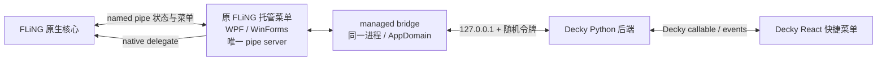

# FLiNG 菜单双向同步可行性研究

研究与首个实现日期：2026-07-30
v0.3.0 unified managed bridge 更新：2026-07-31
v0.4.0 数值写入与焦点恢复更新：2026-08-02
v0.4.9 数值核心应用事务与 Bridge 0.4.3 ABI 修正：2026-08-03
v0.5.1 Sifu 实机启动回退与 Bridge 资源刷新诊断更新：2026-08-03
v0.6.1 单 Bridge 后端更新：2026-08-04
v0.6.2 显式返回游戏与输入焦点恢复更新：2026-08-04
v0.6.4 Sifu 菜单解析与 Decky 手柄提示更新：2026-08-06
v0.6.7 独立心跳与非阻塞 UI 命令更新：2026-08-07
v0.6.8 SteamOS 整屏焦点过渡更新：2026-08-07
v0.7.0 Host 内嵌 CLR2/CLR4 Bridge 更新：2026-08-20

## 结论

FLiNG 的原生修改器核心与其托管 WPF/WinForms 菜单之间存在结构化的“命名管道 + 进程内
callback”协议。
因此，TrainerDeck 可以实现“修改器窗口与 Decky 菜单使用同一份核心上报状态”的双向
同步，不必继续把“已发送快捷键”当成“修改已成功”。

v0.3.0 已把统一的同进程 bridge 接入 Decky：

- 核心把菜单元数据发送给托管界面；
- 核心把一个进程内函数指针交给托管界面；
- WPF 或 WinForms 点击通过该函数指针直接调用核心，不把开关命令写入管道；
- 核心处理后，把同一个选项 ID 和核心状态写回界面；
- 同进程 managed bridge 可以调用同一个函数指针，并把核心回执转发给 Decky；
- v0.3.0 从 `SetOptionList` 协议读取菜单载荷，从
  `SetCheatOptionState` 协议读取 ID 与核心布尔状态，UI 差异只留在薄适配器中；
- Python 后端保存完整菜单快照，通过 `decky.emit` 和 callable 提供给前端；
- React 面板显示三语 tooltip 和核心确认状态，不发送快捷键；
- v0.4.9 按控件能力发布 `integer` / `number` / `text` 类型与
  `stage_then_toggle` / `invoke` 调用模式；写值阶段同时等待 Bridge 明确回执与原控件
  snapshot 回显，配套开关还必须完成核心关闭/开启状态事务；
- 无输入的 `<input_set>` / `no_textbox` 作为独立纯动作，只显示“应用”按钮并通过
  `action_command` 调用一次原 delegate，不维护虚假的开关或数值状态；
- 鼠标、DOM focus 或 Decky 手柄焦点进入带感叹号的项目时，在行下展开可滚动说明；
  修改控件禁用时仍保留独立说明入口；原修改器窗口保持自身默认可见。

数值能力采用失败关闭：只有 setter、当前值、类型和调用模式同时匹配的控件才开放。
`stage_then_toggle` 由后端作为一项事务执行：已开启时先等核心确认关闭，再写入原控件，
同时等待 Bridge 的 `staged` 回执和 snapshot 回显新值，最后重新开启并等待核心确认；
未开启时跳过关闭阶段，写值确认后直接开启。`invoke` 先写入原控件再派发原 delegate，
并等待 `applied` 回执与 snapshot 回显。请求同时校验 UI snapshot revision 和旧值，
不能把“文本框已经显示新值”或“命令已发送”单独当作成功。Bridge 0.4.3 通过
`value_command_receipt_v1` 公布这套回执契约；更早版本不会开放数值入口。

纯动作也采用失败关闭：菜单必须明确隐藏输入，并且原 delegate 的签名必须受支持；
若 delegate 是新版 WPF 双参数签名，bridge 传入空字符串作为命令参数。一次点击仅在
delegate 同步返回后以 `applied` 完成，拒绝、超时或断连都会保留独立动作错误。

实现完成不等于 Proton 兼容性已经验收。v0.5.0 的 Sifu 实机记录已经暴露并定位一次
启动失败：补丁进程退出码为 0、生命周期约 10.29 秒，但 `bridge_ready=false`；5 秒
短退出限制错误地禁止启动原 EXE。v0.5.1 修正这一回退条件；v0.6.1 曾固定使用单一
`net35` Bridge。v0.7.0 改为由单一外部 Host 内嵌 CLR2/net35 与 CLR4/net40 payload，
同时核对目标 UI 的 metadata runtime 和 `mscorlib` 主版本后选择完全匹配的一份；两种
payload 都不会作为外部插件文件发布。缓存按修改器哈希、AppID 与会话 token 哈希隔离，
补丁 EXE、所选 payload 和已读取 manifest 作为不可变代际原子发布。临时资源更新、
Host 同时把外层原子 manifest 路径交给已准备子进程，使运行中的 Bridge 可在后端重启后
读取新端口与 token，不需要重写该缓存代际。WPF/WinForms 调度、loopback、
数值实际生效和 Gamescope 输入路由仍需在
Steam Deck 上继续验证。2020 年以前的版本、纯 native UI 与未知协议也不在当前结论内。

## 样本与安全边界

样本来自 [FLiNG 官方 Cyberpunk 2077 页面][fling-cp2077]，仅下载并进行静态
分析，没有在开发机执行。

- 文件：`Cyberpunk 2077 v2.0-v2.13 Plus 46 Trainer.exe`
- 大小：1,555,968 字节
- SHA-256：
  `FB342EB237F6EC8AD4292249C97F2A84CB7625B22ADFB89E17E16C6CC0FB11D3`
- Authenticode：未签名

修改器本身会读写其他进程内存，安全产品通常会把这种行为归类为
GameHack/PUP。该样本也有对应的 [ANY.RUN 公开记录][anyrun-sample]。这些结果
既不能证明它安全，也不能单独证明它是恶意软件；后续动态分析应在一次性 Windows
虚拟机或专用 Steam Deck 测试环境中进行。

本地研究文件位于：

```text
.research/samples/cyberpunk2077/download.bin
.research/samples/cyberpunk2077/static-report.json
.research/samples/cyberpunk2077/strings.json
.research/samples/cyberpunk2077/viv-xrefs.json
.research/samples/cyberpunk2077/pipe-functions.asm.txt
.research/samples/cyberpunk2077/STATIC_IPC_REPORT.md
.research/samples/cyberpunk2077/static/FLiNGTrainerUI.dll
.research/samples/cyberpunk2077/static/ui-il.txt
```

`FLiNGTrainerUI.dll` 是从 `UI/101` 资源静态解密出的托管程序集，SHA-256 为
`73598C50F9BE2E32DB876D025B82F2BB390A8F1CF9A0A6C92431F4AE98E05C8B`。
该资源使用 native 加载代码中的 32 字节循环 XOR key；解密过程和 IL 导出脚本
都保存在 `.research`。

`.research` 已被忽略，不进入插件发布包。

### 《如龙8》提示文字样本

第二个样本来自 [FLiNG 官方《Like a Dragon: Infinite Wealth》页面][fling-lad8]，
同样只下载和静态分析，没有执行。

- 文件：`Like a Dragon Infinite Wealth v1.13-v1.17 Plus 64 Trainer.exe`
- 大小：1,788,416 字节
- SHA-256：
  `EA6D99940E72917B8C99C48F40325B15869F8E4A5A44E50FF44E73FB0496A434`
- Authenticode：未签名
- 64 个修改项中有 31 项带 `**tooltip`；
- EXE 内简中和英文各 31 条，官网 31 条英文 tooltip 与 EXE 逐项一致。

其菜单 DSL 形式为：

```text
修改项文字 --native_alias **鼠标悬停或手柄聚焦时显示的说明
```

WPF 使用最后一个 `**` 分隔项目名和说明，并把简中、繁中、英文分别写入
`InitToolTipText`。例如物品数量修改项包含“在打开物品菜单查看物品时生效”，
卡拉 OK 和飞镖项目包含“需要在开始小游戏之前激活”。因此运行时 bridge 直接读取
原控件的三语 tooltip，而不是从网页、快捷键或项目名推测；Decky 在鼠标悬停或
手柄聚焦时把原文展开在项目下方，长说明可滚动查看。

较新版 UI 还会移除 `{important}` 并把 tooltip 背景设为 RGB
`218,44,67`。bridge 同时识别文本标记和原控件警示色，向 Decky 发布
`tooltip_style: "important"`。

## 已确认的协议

### 连接关系

原生核心是命名管道客户端：

```text
\\.\pipe\FLiNGTrainerNamedPipe_<trainer PID>
```

它调用 `WaitNamedPipeW`，再用 `CreateFileW` 取得读写句柄。托管界面是管道
服务器，并明确设置 `maxNumberOfServerInstances=1`。Wine/Proton 中的命名管道
由同一个 wineserver 管理，Linux 侧的 Decky Python 进程不能直接把它当作 Unix
socket 打开。[Wine 的命名管道实现][wine-named-pipe]也反映了这一对象模型。

### 消息帧

所有 native-to-WPF 消息先写入一个 little-endian `int32 PipeCommand`。已从
解密后的托管 UI 程序集中恢复出完整枚举：

| 值 | 命令 |
| ---: | --- |
| 0 | SetLanguage |
| 1 | SetGuiTexts |
| 2 | SetGameState |
| 3 | SetGameCover |
| 4 | SetOptionList |
| 5 | SetFunctionPointers |
| 6 | SetCheatOptionState |
| 7 | SetTrainerUpdate |
| 8 | GetInputValue |
| 9 | SetTrainerWindowSizeLimit |
| 10 | CustomCommand |

静态反汇编确认了两种字符串帧：

```text
narrow string: uint32_le byte_length + byte[byte_length]
wide string:   uint32_le byte_length + utf16le[byte_length]
```

接收窄字符串时同样先读取 4 字节长度，再读取对应字节数。托管 UI 对
`GetInputValue` 的回复是带结尾 NUL 的 UTF-8 字符串，并把 NUL 计入长度。
初始化阶段还可见 `TRAINER_ID`、`TRAINER_INITIALIZE`、
`CUSTOM_INIT_MESSAGE` 等握手消息。

### 菜单定义

修改器内含可解析的菜单 DSL，而不是只有显示名称和快捷键。例如：

```text
Num 1 - Infinite Health --health
Ctrl+Num 1 - <input default="9999999"> --money
Shift+... - <slider min="-10000" max="10000" default="10" step="10">
              --fly_height_f
```

二进制中的 native 解析正则会提取 `--health` 这类内部别名；托管 UI 则从热键生成
用于点击与状态同步的控件 ID，例如：

```text
Num 1       -> N1
Ctrl+Num 1  -> CN1
Shift+F1    -> SF1
Alt+PageUp  -> APageUp
```

因此 `--health` 不能直接当作托管 UI 的协议 ID。解析完整 DSL 后仍可获得：

- 显示名称；
- 快捷键；
- 托管 UI 热键派生 ID；
- native 内部别名；
- `toggle`、`input`、`input_set`、`input_adjust`、`slider` 等控件类型；
- 默认值、最小值、最大值和步长。

这比当前从网页提取 `Num 1 - Infinite Health` 更完整，也不会把本地化显示名当作
协议键。

### 双向状态

托管 UI 收到 `SetFunctionPointers (5)` 后，把 native 指针转换成命令
delegate。不同 UI 版本的菜单点击分别调用：

```text
旧 WinForms：   ToggleCheat(option.ID)
过渡期 WPF：   ToggleCheat(option.ID)
2024《如龙8》：ExecuteTrainerCommand(option.ID)
较新版 WPF：   ExecuteTrainerCommand(option.ID, "")
```

21 样本回归覆盖了 `ToggleCheat` 与一/二参数 `ExecuteTrainerCommand`。
当前 bridge 会按已验证签名选择 delegate；所有路径都是调用修改器已有的进程内
函数，不发送键盘事件。新版 WPF 的第二参数是 `args`，普通修改项点击时为空；数值由
native 核心通过现有 `TrainerCall_GetInputValue(option.ID)` 回调从托管控件读取，而不是
通过第二参数传递。非空 `args` 用于修改快捷键等控制命令，不能复用于普通修改项。
这些历史样本只作为协议研究证据，不再构成多 CLR 后端选择逻辑。

这个调用发生在修改器进程内，并不经过命名管道。核心执行菜单项后，通过
`SetCheatOptionState (6)` 写回：

```text
uint32_le id_length
byte[id_length] option_id
uint32_le enabled
```

其中 `enabled` 是核心上报的结果，不是 GUI 的乐观状态。托管 UI 按 ID 找到控件
并更新原窗口。v0.3.0 在协议读取处捕获同一个 ID 与 `enabled`，不再依赖某一代
UI 的 `SetOptionState` IL 形状。这使下面两条路径可以共享同一核心状态：

```text
Decky 点击 -> 同进程 bridge 调 delegate -> 核心执行 -> 核心回执 -> Decky 更新
原修改器窗口点击 -> 核心执行 -> 核心回执 -> bridge 观察 -> Decky 更新
```

## 已实现的统一架构



Decky 自己已经提供前后端 RPC 和事件通信，插件应直接使用它们。唯一需要新增的
传输层是 Proton 内 Windows bridge 到 Decky Python 后端之间的本机连接。

### 原窗口与 bridge 共存

不能让 Decky 或外部 `bridge.exe` 作为第二个客户端旁路连接：

- 原托管 UI 显式创建单实例管道；
- byte stream 不会向多个客户端广播；
- 更关键的是，点击入口是 native 函数指针。该地址只能在修改器进程中安全调用。

详见 [.NET 构造函数说明][named-pipe-server-stream]和
[CreateNamedPipe 文档][create-named-pipe]。

当前 launcher 离线修改内嵌托管 UI，但只运行临时副本：

1. 校验 trainer 和内嵌 UI 的哈希或协议指纹。
2. 从 `UI/101` 资源解密托管 UI 程序集。
3. 向 `TrainerCall_SetFunctionPointers` 注入一次
   `TrainerDeckBridge.EntryPoint.Start(this)`；
4. 在 `TrainerCall_SetOptionList` 调用 `SetupCheatOptions` 前，按不改变原求值栈
   的方式注入 `ReportMenuPayload(this, zhCn, en)`，以 `**` 解析菜单和提示。英文行
   未携带 widget DSL 时，以配对中文行的控件字段为权威，不再把英文占位 toggle 当成
   冲突；
5. 在 `TrainerCall_SetCheatOptionState` 的唯一 `ReadString` / `ReadInt32` 协议
   读取处注入 `ReportOptionState(this, id, raw == 1)`，只把核心回执作为开关
   状态权威；
6. bridge 通过 WPF `Dispatcher + Children` 或 WinForms
   `BeginInvoke + Controls` 薄适配器补充 ID、可用性、游戏状态与输入值；
7. 增加只绑定 `127.0.0.1`、使用随机令牌的本机端点。
8. 网络线程只把请求放入队列；在框架适配器的 UI 执行上下文中按反射到的
   delegate 签名调用 `Invoke(optionId)` 或 `Invoke(optionId, "")`，避免与
   pipe 读循环和 communication lock 发生重入或死锁。
9. 调用前复用 `SetGameState` / `IsGameRunning` 和控件可用性判断，不能绕过原
   UI 的“游戏未检测到”保护。
10. 数值命令在 UI 线程优先调用原 `SetInputValue(string)`，或按已验证类型写入
    可写 `Value`；`stage_then_toggle` 返回 `status=staged`、`operation=value`、
    `invoked=false`，`invoke` 写值后调用原 delegate 并返回 `status=applied`、
    `operation=value`、`invoked=true`。二者都继续发布包含新值的 snapshot。
11. 后端要求数值命令携带旧值和 bridge revision，并验证长度、有限数值、整数与
    min/max；写值只有在合法回执与 snapshot 回显同时到达后才能进入下一阶段。
    `stage_then_toggle` 在同一 option 上串行执行“核心关闭（如原本开启）→ 写值 →
    核心开启”，最终必须收到 `active=true` 的核心回执，避免文本框变化但游戏数值未生效。
12. bridge 不改变原窗口的可见性、任务栏或激活状态；修改操作不会关闭快捷菜单，前端
    也不再提供全局 App 级窗口提升。用户通过 SteamOS 的正常方式关闭快捷菜单或切换窗口。
13. 把修改后的 UI 重新加密并用资源 API 写入运行时临时副本，不覆盖用户下载的
   原文件。

原修改器界面、唯一 pipe server 和 native callback 都被保留；当前 managed
bridge 已运行在同一 CLR AppDomain 中，离线补丁只负责把它挂入原 UI 生命周期。

launcher 会在启动前记录 ready 日志的基线，只接受本次启动后新增的
`Bridge started.`。v0.5.1 等待完整启动观察窗；若窗口结束时补丁进程已经退出且仍没有
新鲜 ready，就启动未修改的原修改器，不再使用 5 秒生命周期阈值判断是否允许
fail-open。补丁进程仍存活、已确认 ready，或启动后的监控状态不明确时继续禁止第二实例。
后端升级刷新旧绑定时仍覆盖同一 Launcher 路径，但会在串行事务中先完成唯一 staging，
再分别原子替换 Host、Cecil 与 manifest；失败时恢复旧文件，整组成功后才移除旧外置
Bridge。一个物理安装不会同时向两个 AppID 发布 manifest；重复绑定会在改写文件前停止。
资源复制或 manifest 写入异常会记录为对应应用的 `error` 快照，供 Decky 面板直接显示。

UI Automation 可用于快速探索标准 WPF `ToggleButton`、`TextBox` 和 `Slider`
是否暴露状态，但在 Wine/Proton、隐藏窗口和 Gaming Mode 下兼容性不足，只作为
开发诊断手段，不作为产品控制或回退路径。

## 前端状态模型

前端不能再用一个本地布尔值表示“最近按过快捷键”。建议至少使用：

```ts
type TrainerOptionStatus =
  | "unknown"
  | "pending"
  | "enabled"
  | "disabled"
  | "unavailable"
  | "error";
```

开关命令进入 `pending`，只有核心布尔回执才能进入 `enabled` 或 `disabled`；数值
命令独立使用 `value_pending / desired_value / value_error`。写值阶段必须同时收到
符合调用模式的 `command_accepted` 和原控件 snapshot 回显；`stage_then_toggle` 还要
等最终 `active=true` 核心状态后才完成。超时、游戏未挂接、版本不匹配和 bridge 断开
必须显式显示，不能伪装成关闭状态、写入成功或已经作用于游戏。

这里的“权威”仅表示 FLiNG 核心自己的协议状态。静态分析不能证明每一次内存修改
都已在目标游戏中成功生效；游戏版本不匹配等错误仍要单独建模。

## 分阶段实现

### P0：移除按键控制（已完成）

- 删除 Steam HID / `EHIDKeyboardKey` 发送代码；
- 删除网页和 JSON 清单生成的按键按钮；
- 删除乐观布尔状态；
- 不支持 bridge 的版本只显示 `unavailable`，传统操作交给 CheatDeck。

### P1：统一运行时菜单模型（代码完成，待 Proton 实机验收）

- 以 `SetOptionList` 的协议载荷作为菜单和 `**` tooltip 的共同来源；
- 用 WPF/WinForms 薄适配器补充 ID、可用性、当前值和数值约束；
- 用 UI 程序集指纹与成员能力识别适配器；
- 网页解析只负责搜索、版本和下载，不生成任何控制入口。

### P2：只发布核心状态的统一补丁（代码完成，待 Proton 实机验收）

- 保留原托管 UI 的单实例 pipe server；
- 从 `SetOptionList` 协议读取菜单，从原控件读取 `SetGameState` 和
  `GetInputValue` 更新的数据；
- 在 `SetCheatOptionState` 的协议读取处捕获 option ID 与核心布尔回执，不把
  后续 WPF `IsChecked` 或 WinForms `Toggled` 轮询当作状态权威；
- 把菜单与状态发布到只监听 loopback 的端点；
- 仍需在隔离 Steam Deck 环境测试启动、开、关、原窗口操作和游戏退出。

### P3：开关双向同步（代码完成，待 Proton 实机验收）

- Decky 按原托管 UI 的 opaque ID 请求操作；
- 同进程 bridge 在确认游戏状态和控件可用后反射 delegate 的 `Invoke` 参数数，
  对 `ToggleCheat` 或单参数 `ExecuteTrainerCommand` 调用 `Invoke(ID)`，对
  二参数版本调用 `Invoke(ID, "")`；第二参数是命令 `args`，不是数值；
- 收到核心回执后更新；
- 原修改器窗口、CheatDeck 或物理快捷键产生的核心回执也只作为入站状态推送到
  Decky；
- 重连后状态先标记 `unknown`，等待重新初始化或查询。

### P4：数值与滑块（代码完成，待 Proton 实机验收）

- bridge 只为成员契约完整的控件发布 `value_controllable`、`value_type` 和
  `value_apply_mode`；未知组合保持 `unavailable`；
- `stage_then_toggle` 在对应 UI 线程调用 setter 或写入 `Value`；后端若发现项目已
  开启，先等核心关闭，再等待 `staged` 回执与 snapshot 回显，最后重新开启并等核心
  `active=true`。项目原本关闭时则写值确认后直接开启；
- `invoke` 用于一次性 `SetValue` 动作，先写原控件再调用 delegate，每次“应用”都
  派发，即使输入值与当前显示相同；
- 新版双参数 WPF 仍调用 `Invoke(ID, "")`；native 核心通过
  `TrainerCall_GetInputValue(ID)` 读取刚写入的原控件；
- 后端用旧值与 revision 做 CAS，验证 integer/number/text、有限值和 min/max，
  并在合法数值回执、snapshot 回显及所需最终核心状态全部确认前保持
  `value_pending`；
- 未确认的控件不提供按键回退；Bridge 0.4.3 以 `value_command_receipt_v1` 公布
  所需回执能力，更早 bridge 必须升级。

### P4.1：无输入纯动作（代码完成，待 Proton 实机验收）

- `<input_set>` 无属性以及带 `no_textbox` 标记的项目发布 `action_controllable`，Decky
  行只渲染一个“应用”按钮；
- 命令只携带 option ID、session ID 和 bridge revision，不携带伪造的 desired/value；
- bridge 在 UI 线程调用原 delegate；需要双参数时第二参数固定为空字符串；
- 后端只接受 `status=applied`，并将拒绝、超时和断连写入独立 `action_error`。

### P5：提示可见性与窗口策略（代码完成，待 Gamescope 实机验收）

- 带感叹号的项目在鼠标悬停、DOM focus 或 Decky `onGamepadFocus` 时于项目下方显示
  原 tooltip，长文本自动滚动到可见区域并允许继续滚动；底层修改控件禁用时，独立说明
  入口仍可聚焦并用 A 键固定展开；
- bridge 不调用原修改器窗口的 `Hide`、`Show` 或 `Activate`，保留 FLiNG 自身的窗口
  与任务栏行为，用户可通过 Steam 窗口切换进入；
- 开关等待核心布尔状态、数值等待原控件同值回读、纯动作等待 `status=applied`；最终
  确认成功只更新面板，不自动关闭 Decky 快捷菜单；
- 用户可连续操作任意多个项目；前端不自动关闭快捷菜单，也不调用 App 级
  `RaiseWindowForGame` 猜测同一 App 内应聚焦的具体窗口；若用户显式开启输入恢复设置，
  则只在整个 QAM 关闭后先完成带 token 的主 GamepadUI 整屏焦点过渡，再用目标 AppID
  调用该 Steam 原生接口返回游戏；
- 拒绝、断连或 4 秒超时保留面板并显示错误。

## 可行性评级

| 目标 | 评级 | 原因 |
| --- | --- | --- |
| 开关类菜单的核心状态双向同步 | 高（静态） | delegate、opaque ID 和核心布尔回执均已静态确认 |
| 自动生成菜单结构 | 高（静态） | `SetOptionList`、`**` tooltip、菜单 DSL 与薄适配器均已确认 |
| 数值框和滑块双向同步 | 中高（静态） | setter/`Value`、两种调用模式、数值回执、snapshot 回显及开关核心事务已实现，仍需 Proton 验证实际生效 |
| 无输入“应用”动作 | 中高（静态） | 菜单隐藏输入标记、独立动作协议与原 delegate 调用已实现，仍需 Proton 验证游戏效果 |
| 提示可见性与窗口输入路由 | 中高 | Decky 手柄焦点展开和原窗口透传已接入；同一 App 多窗口的 Gamescope 输入路由仍需逐游戏动态验收 |
| 保留原界面并透明同步 | 中高 | 同进程结构与 WPF/WinForms 薄适配成立，但尚未 Proton 动态验收 |
| 2020–2026 矩阵内托管修改器 | 高（静态） | v0.3.0 unified bridge 已达到 21/21 `--prepare-only` |
| 2020 年以前、纯 native 或未知协议 | 未知 | 当前语料不足，必须按指纹失败关闭 |
| 仅靠快捷键实现强一致 | 不可行 | 快捷键没有成功、失败或当前状态回执 |

## Proton 实机验收门槛

v0.3.0 的静态回归已覆盖矩阵中的 21 个 WPF/WinForms 样本；发布为“动态兼容”
前还必须完成：

1. 原窗口开启和关闭同一选项时，bridge 得到相同 opaque ID 与相反布尔回执；
2. bridge 调用同一 ID 时，原窗口和 Decky 都更新到核心回执值；
3. 游戏未运行、版本不匹配、游戏退出时不会把失败显示为成功；
4. `stage_then_toggle` 能在“关 → 写 → 开”或“写 → 开”事务中分别确认核心状态、
   数值回执与原控件回显；`invoke` 能确认写值与 delegate 派发。二者都能区分发送值、
   原控件回读值和实际游戏效果，越界、旧值冲突和超时不会显示为成功；
5. 无输入动作每次点击只执行一次，拒绝、超时或断连不会显示为成功；
6. 感叹号说明在启用与禁用修改项上都能由手柄查看；关闭快捷菜单后逐游戏验证输入路由，
   对同一 App 同时存在游戏与修改器窗口的样本记录具体 window ID；
7. bridge 崩溃、版本过旧或协议不匹配时，原修改器不会失去控制；
8. WPF 与 WinForms 至少各选两个不同年份、不同游戏的 Steam Deck/Proton
   实机样本通过。

[fling-cp2077]: https://flingtrainer.com/trainer/cyberpunk-2077-trainer-16095388215/
[fling-lad8]: https://flingtrainer.com/trainer/like-a-dragon-infinite-wealth-trainer/
[anyrun-sample]: https://any.run/report/fb342eb237f6ec8ad4292249c97f2a84cb7625b22adfb89e17e16c6cc0fb11d3/ece6af39-52bc-44a3-9080-0fc050286147
[wine-named-pipe]: https://github.com/wine-mirror/wine/blob/master/server/named_pipe.c
[named-pipe-server-stream]: https://learn.microsoft.com/en-us/dotnet/api/system.io.pipes.namedpipeserverstream.-ctor
[create-named-pipe]: https://learn.microsoft.com/en-us/windows/win32/api/winbase/nf-winbase-createnamedpipea
